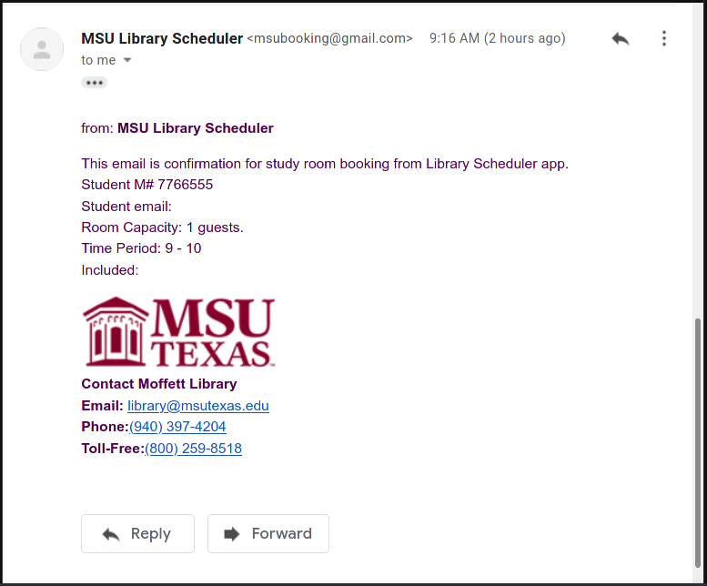
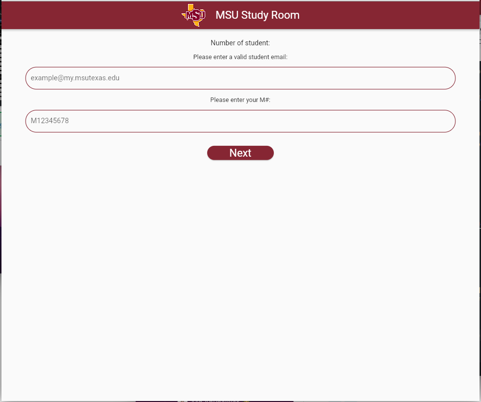

# MSU Library Scheduler
MSU Library Scheduler is MSU Hackathon project for Spring 2022.
## Description
A mobile app that will make 'Midwestern State University Texas' students schedule a study room at MSU Moffet Library. We used flutter/dart to build cross platform mobile app that will work on both … 
## Web Live Version:
  - Link (http://killzombieswith.us/libraryscheduler/)
## Collaborators
  - Joachim Isaac (https://github.com/JoachimIsaac)
  - Fowzy Alsaud (https://github.com/fowzy)
## Files
|   #   | File            | Description                                        |
| :---: | --------------- | -------------------------------------------------- |
|   1   | [README.md](README.md)         | README file.      |
|   1   | [/test23](/test23)         | Project files      |
## Screenshots

